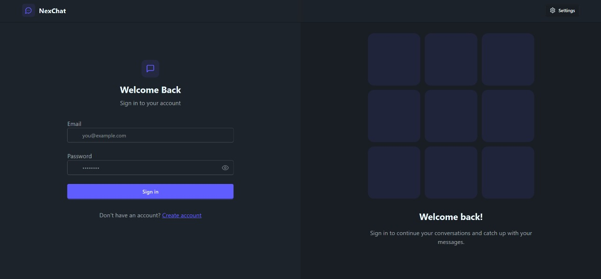
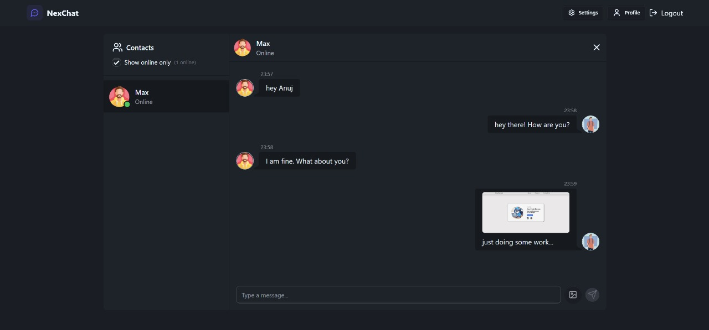
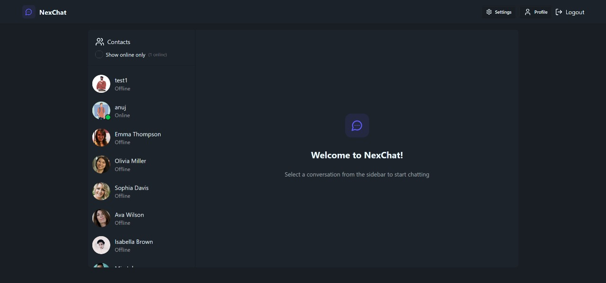
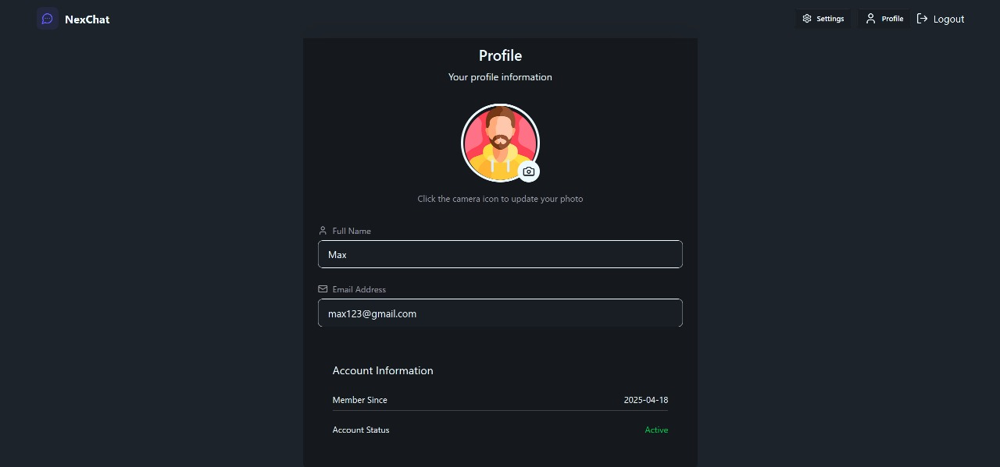

# NexChat 💬

**NexChat** is a real-time chat application built as a demo project using **Socket.io**. It features a sleek UI and enables users to chat instantly across devices.

## 🚀 Features

- Real-time messaging powered by **Socket.io**
- Modern and responsive UI
- live user status
- Smooth user experience with React and Tailwind CSS

## 🛠️ Technologies Used

### Backend
- ⚙️ **Express.js**
- 🔌 **Socket.io**

### Frontend
- ⚛️ **React**
- 🎨 **Tailwind CSS**
- 🌼 **DaisyUI**

| Login Page | Chat Interface |
|------------|----------------|
|  |  |

| Room View  | Profile |
|------------|----------------|
|  |  |

---

## 🧪 How to Run the Project

### 🔗 Clone the Repository

```bash
git clone https://github.com/DevilPaddy/NexChat.git
cd NexChat
```
## backend
```bash
cd backend
npm install
node index.js
```
## frontend
```bash
cd ../frontend
npm install
npm run dev
